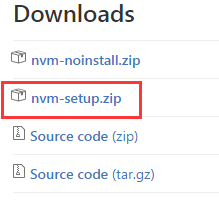

# 前言II (React 构建工具介绍)

工欲善其事，必先利其器。React 的火爆得力于来自社区的工具，而 React 也推动了这些工具的进步。笔者是刚刚接触前端,初学react,这里介绍一些,构建react工程需要用到的一些工具 . 如`ES6+`, `npm`,`nvm`,`webpack`,`babel`,`eslint`,`React Developer Tools`

## ES6+
ES6+ 系指 ES6（ES2015）和 ES7 的联集，在 ES6+ 新的标准当中引入许多新的特性和功能，弥补了过去 JavaScript 被诟病的一些特性。
如解决ES5 中的如下问题.
* 没有块级作用域，这个导致上面示例7的问题
* 全局变量的污染
* 类的写法比较怪异
* 没有模块管理
* 异步调用写法容易产生 “回调地狱”

由于笔者之前没有接触过js,所以可以没有负担的直接使用es6+.并且后面的示例也将使用es6+.

学习es6+特性,推荐观看 [ECMAScript 6入门][1] 以及 [Airbnb JavaScript Style Guide][2]

## npm
NPM（Node Package Manager）是 Node.js 下的主流套件管理工具.npm用于下载和管理react相关的依赖包,是构建react环境不可缺少的工具.node.js 中就自带有nmp,所以我们要安装node.

**安装node**

1, 如果安装了nvm,直接使用命令安装node.js
```bash
nvm install node
```
2, 如果不想使用nvm,使用macOS可以通过homebrew安装
```bash
brew install node
```
3, 还可以去node官方网站下载相应的安装包进行安装.
官网: [https://nodejs.org/zh-cn/][3]
## nvm
在开发的过程中,我们可能需要切换node的版本,所以建议使用nvm (全名为 node.js version manager) 来管理node.
nvm的github地址  [https://github.com/creationix/nvm][4]

**安装nvm**

对于macOS用户

1, 使用 `cURL`
```bash
curl -o- https://raw.githubusercontent.com/creationix/nvm/v0.32.1/install.sh | bash
```
或者 `Wget`
```bash
wget -qO- https://raw.githubusercontent.com/creationix/nvm/v0.32.1/install.sh | bash
```

2, 在 (~/.bash_profile, ~/.zshrc, ~/.profile, or ~/.bashrc).任意配置文件中(建议在`~/.bash_profile`)配置
```bash
export NVM_DIR="$HOME/.nvm"
[ -s "$NVM_DIR/nvm.sh" ] && . "$NVM_DIR/nvm.sh" # This loads nvm
```
3, 保存生效
```bash
source ~/.bash_profile
```

windows 用户 
nvm-windows gitlub地址 : [https://github.com/coreybutler/nvm-windows][5]

直接选择安装包下载安装即可.


**nvm 基本使用**

安装指定版本的node
```bash
nvm install version_code # (4.2.2)
```
安装最新版本
```bash
nvm install node
```

版本切换
```bash
nvm use 4.2.2
```

切换到最新版：
```bash
nvm use node
```

删除某个版本:
```bash
nvm uninstall 4.2.2
```

列出本地的所有版本:
```bash
nvm ls 
```

列出服务器的所有版本
```bash
nvm ls-remote
```

其他指令请查询官网.

## webpack
![enter description here][6]

Webpack 是德国开发者 Tobias Koppers 开发的模块加载器.
在 Webpack 当中, 所有的资源都被当作是模块, js, css, 图片等等..
因此, Webpack 当中 js 可以引用 css, css 中可以嵌入图片 dataUrl.
对于react的工程化开发很有帮助.

webpa的官网: [https://webpack.github.io][7]

**使用npm安装webpack:**

```bash
# 在全局安装
npm install -g[enter description here][8] webpack

# 在项目内安装 
npm install --save-dev webpack
```

webpack 还提供了一个轻量级的node.js express服务器. `Webpack-dev-server`.
Webpack-dev-server 有两种模式.iframe模式和inline模式。在iframe模式下：页面是嵌套在一个iframe下的，在代码发生改动的时候，这个iframe会重新加载；在inline模式下：一个小型的webpack-dev-server客户端会作为入口文件打包，这个客户端会在后端代码改变的时候刷新页面。 `webpack-dev-server --inline`
 webpac-dev-server支持Hot Module Replacement，即模块热替换，在前端代码变动的时候无需整个刷新页面，只把变化的部分替换掉。 `webpack-dev-server --hot`
 
 **使用npm安装webpack-dev-server**
```bash
npm install --save-dev webpack-dev-server 
```

在后面构建react的章节会介绍webpack的一些基本配置.

## babel
由于并非所有浏览器都支援 ES6+ 语法，所以透过 Babel可以让你的 ES6+ 、JSX 等程式码转换成浏览器可以看的懂得语法。通常会在资料夹的 root 位置加入 ` .bablerc`  进行转译规则 preset 和插件（plugin）的设定.
这样就可很放心的使用es6+的语法来编写前端代码了.

没接触babel建议看看这篇文章: [Babel 入门教程][9]

## eslint
在团队协作中，为避免低级 Bug、产出风格统一的代码，会预先制定编码规范。使用 Lint 工具和代码风格检测工具，则可以辅助编码规范执行，有效控制代码质量。
而ESLint 是一个提供 JavaScript 和 JSX 的程式码检查工具，可以确保团队的程式码品质。
目前主流的检查规则会使用 Airbnb 所释出的 `Airbnb React/JSX Style Guide`，在使用上需先安装 `eslint-config-airbnb` 等套件。


未接触过eslint的,建议阅读: [ESLint 使用入门][11]

## React Developer Tools
React Developer Tools是一款由facebook开发的有用的Chrome 浏览器扩展，可以通过 Chrome Web存储获取。使用 Chrome Devtools 进行调试时，可以查看应用程序的 React 组件分层结构.而不是像babel那样,将代码转为es5语法.
对于快速定位问题,有很大帮助.

**注释:如果使用webpack-dev-server,需要将模式设为 inline,否则组件会检测失败**

```bash
webpack-dev-server --inline
```

插件地址 : [https://chrome.google.com/webstore/detail/react-developer-tools/fmkadmapgofadopljbjfkapdkoienihi][10] 


## 参考文章
1. [为什么使用ES6+][12]
2. [WEBPACK DEV SERVER][13]
3. [（Lean React）- 2.2 webpack][14]
4. [使用nvm 让不同版本的Node.js 共存][15]
5. [ESLint React 心得][16]

----
| [目录][17] |  [上一章:前言Ⅰ(React简介)][18]  |  [下一章:React 环境构建][19]  |


  [1]: http://es6.ruanyifeng.com/
  [2]: https://github.com/yuche/javascript
  [3]: https://nodejs.org/zh-cn/
  [4]: https://github.com/creationix/nvm
  [5]: https://github.com/coreybutler/nvm-windows
  [6]: ./img/what-is-webpack.png "what-is-webpack.png"
  [7]: https://webpack.github.io
  [8]: http://www.cnblogs.com/cnblogsfans/p/5146165.html
  [9]: http://www.ruanyifeng.com/blog/2016/01/babel.html
  [10]: https://chrome.google.com/webstore/detail/react-developer-tools/fmkadmapgofadopljbjfkapdkoienihi
  [11]: https://csspod.com/getting-started-with-eslint/
  [12]: http://www.cnblogs.com/cnblogsfans/p/5146165.html
  [13]: http://www.jianshu.com/p/941bfaf13be1
  [14]: https://segmentfault.com/a/1190000005612506
  [15]: https://gold.xitu.io/entry/5705f95671cfe40054248f16
  [16]: http://kyoyadmoon.github.io/blog/2016/03/23/eslint-react-extends-airbnb/
  [17]: https://github.com/JimmieQian/my-react-ship
  [18]: https://github.com/JimmieQian/my-react-ship/blob/master/lesson01/README.md
  [19]: https://github.com/JimmieQian/my-react-ship/blob/master/lesson01/react_build.md